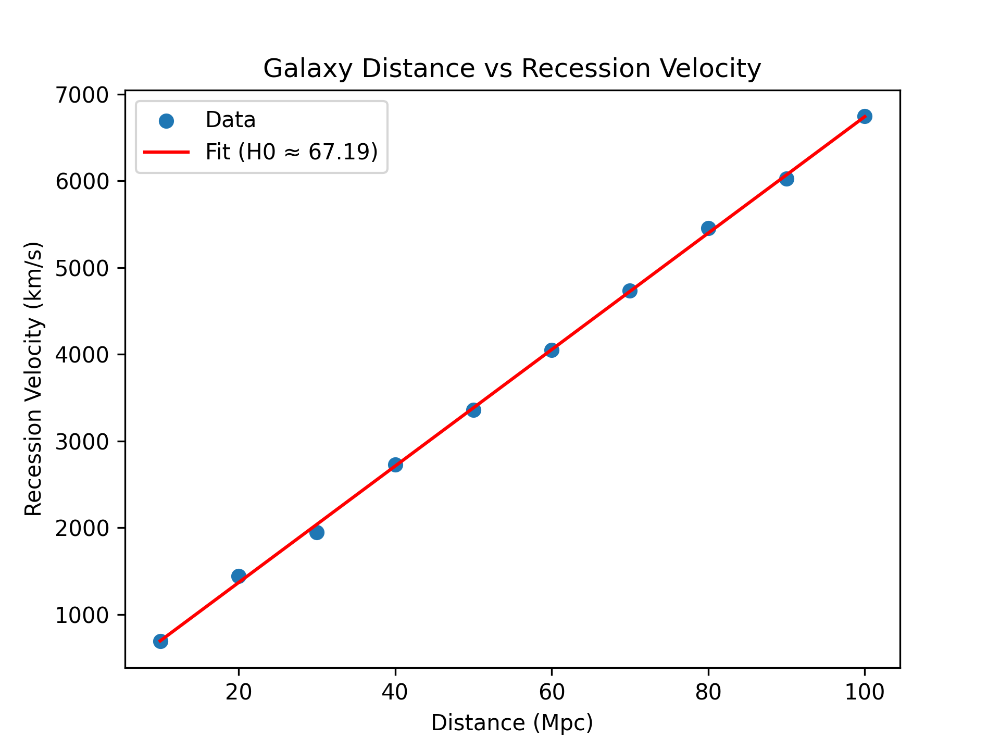
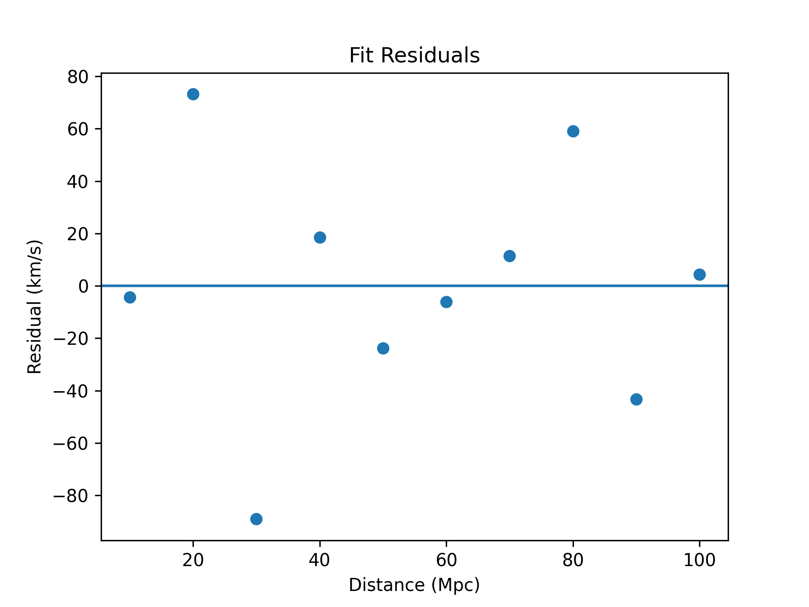

# Galaxy Redshift and Cosmic Expansion Analysis

This project estimates the Hubble constant using galaxy redshift and distance data.

## Method
Redshift values were converted to recession velocities using v = cz. A linear regression model was fit to the velocity-distance relationship.

## Results

### Distance vs Velocity

### Residuals

## Key Result
H0 ≈ 67 km/s/Mpc

## Notes
The relation v = cz is valid for small redshift. Scatter in the data reflects measurement uncertainty and galaxy peculiar velocities.
