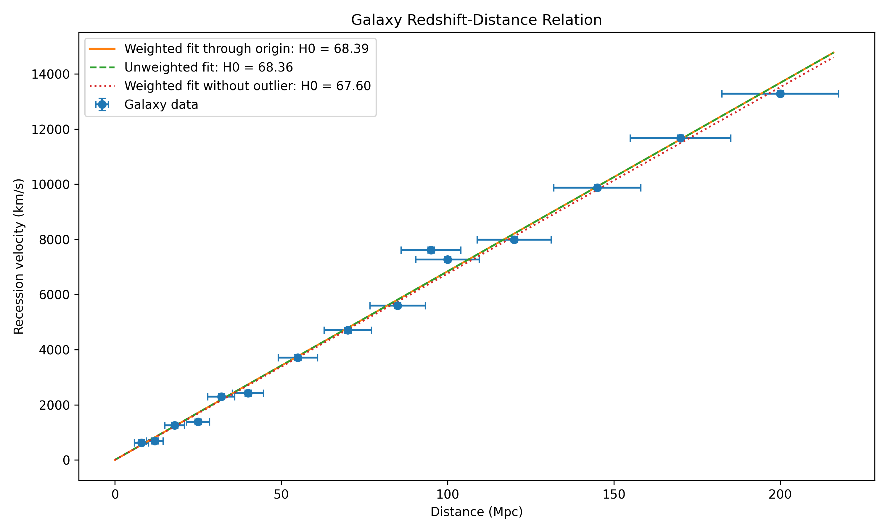
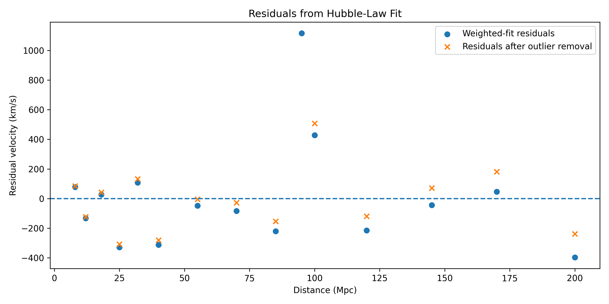

# Galaxy Redshift Expansion Analysis

This project estimates the Hubble constant from galaxy redshift and distance data. It converts redshift to recession velocity using v = cz, fits the redshift-distance relation, compares regression choices, and evaluates uncertainty in the fitted value of H0.

## Project Goal

The goal is to estimate H0 from galaxy distance and redshift measurements while showing how uncertainty, outliers, and residual behavior affect the result.

## Methods

The analysis includes:

- redshift-to-velocity conversion using v = cz
- weighted linear regression through the origin
- unweighted linear regression with an intercept
- bootstrap confidence interval for H0
- residual statistics
- outlier comparison
- model comparison table

## Repository Structure

    galaxy-redshift-expansion/
    ├── src/
    │   └── main.py
    ├── data/
    │   └── galaxy_redshift_data.csv
    ├── outputs/
    │   ├── hubble_fit_comparison.png
    │   ├── residuals.png
    │   ├── results.csv
    │   ├── model_comparison.csv
    │   └── removed_outliers.csv
    ├── docs/
    │   └── method.md
    └── README.md

## Example Outputs

The main fit compares weighted and unweighted estimates of the redshift-distance relation.

The residual plot shows how individual galaxies deviate from the fitted Hubble-law relation.

## Output Tables

The script saves:

    outputs/results.csv
    outputs/model_comparison.csv
    outputs/removed_outliers.csv

These files include:

- weighted H0 estimate
- unweighted H0 estimate
- H0 estimate after outlier removal
- 95 percent bootstrap confidence interval
- residual statistics
- removed outlier count

## Scientific Context

For small redshift values, recession velocity can be approximated as v = cz. In this regime, the slope of the velocity-distance relation estimates H0. Scatter around the fit can come from measurement uncertainty, limited sample size, and peculiar velocities. Peculiar velocities are local galaxy motions that add to or subtract from the recession velocity caused by cosmic expansion.

## Skills Demonstrated

- Python scientific computing
- astronomical data analysis
- weighted regression
- uncertainty estimation
- bootstrap confidence intervals
- residual analysis
- model comparison

## Run

Install dependencies:

    python3 -m pip install numpy pandas matplotlib scipy

Run the analysis:

    python3 src/main.py

## Advanced Diagnostics

An additional script, `src/advanced_analysis.py`, extends the baseline H0 fit with stability and uncertainty diagnostics.

It adds:

- Monte Carlo propagation of distance and redshift uncertainty
- jackknife influence testing by removing one galaxy at a time
- comparison between classical v = cz velocity and relativistic velocity estimates
- reduced chi-square calculation for fit quality
- additional diagnostic plots and CSV outputs

Run:

    python3 src/advanced_analysis.py

Additional outputs:

    outputs/advanced_results.csv
    outputs/jackknife_influence.csv
    outputs/monte_carlo_h0_distribution.png
    outputs/classical_vs_relativistic_velocity.png
    outputs/jackknife_h0_influence.png

These diagnostics test whether the H0 estimate is stable or strongly affected by one measurement, uncertainty assumptions, or the velocity approximation.
